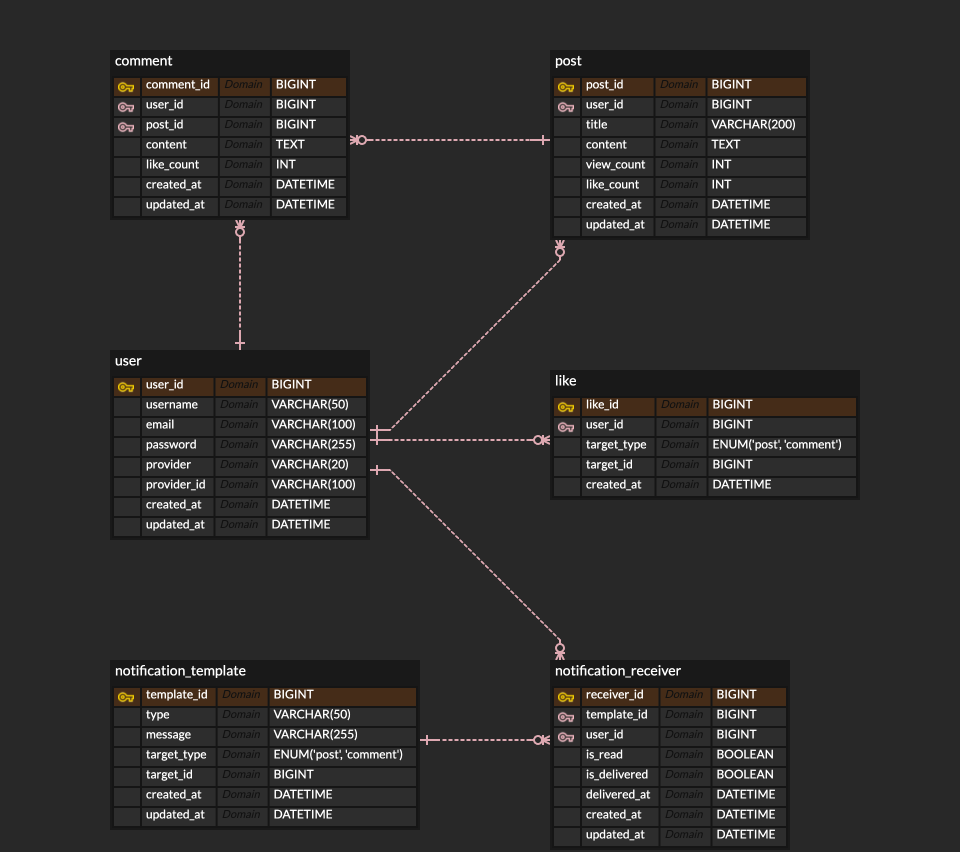

# Posty - 게시판 프로젝트
> 실시간성과 확장성을 고려한 소셜 게시판 서비스

## 📌 주요 기능

- 회원가입 / 로그인 (JWT, 소셜 로그인 지원)
- 게시물 작성 / 수정 / 삭제
- 댓글 작성 / 수정 / 삭제
- 좋아요 (동시성 처리 포함)
- 알림 (Pub/Sub 기반)
- 검색 기능 (게시물 검색 최적화)
- 관리자용 대시보드 (Grafana, Prometheus)

---

## 🧩 ERD (Entity Relationship Diagram)

## ✅ 컨벤션

### 브랜치 전략

- `main`: 배포용
- `develop`: 개발 통합
- `feature/*`: 기능 개발
- `fix/*`: 버그 수정
- `refactor/*`: 리팩토링
- `docs/*`: 문서 수정

### 커밋 컨벤션

- `feat`: 기능 추가
- `fix`: 버그 수정
- `docs`: 문서 작업
- `refactor`: 리팩토링
- `style`: 코드 스타일 변경
- `chore`: 기타 설정
- `test`: 테스트 코드 추가/수정
